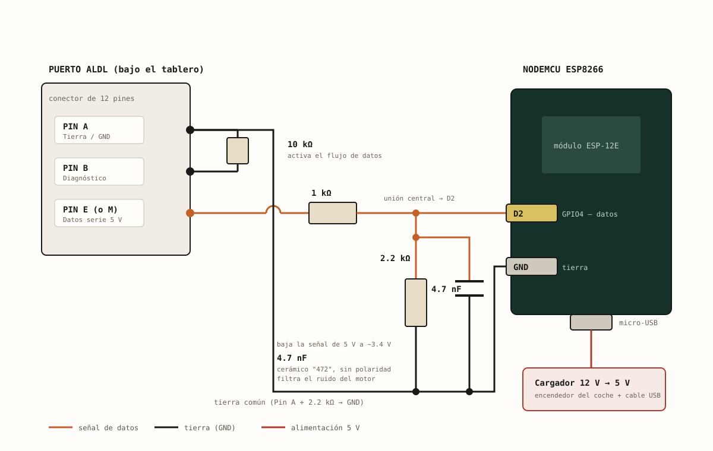
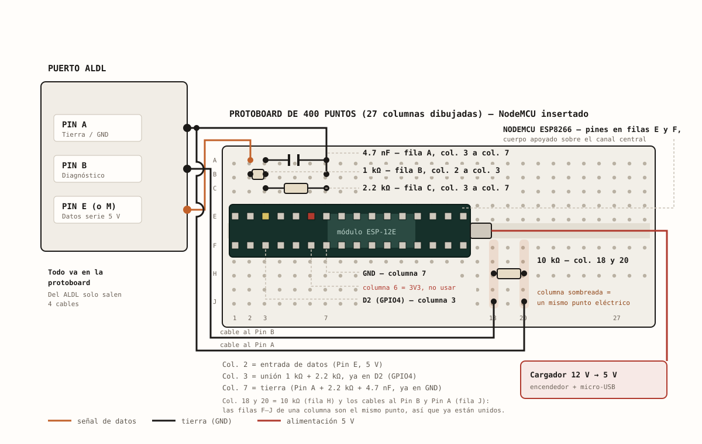

# Conexión electrónica: ESP8266 ↔ conector ALDL

Cómo se conecta el ESP8266 (NodeMCU, módulo ESP-12E) al conector ALDL de un GM OBD1 para
leer su flujo de datos. Es el montaje que usa este proyecto en el **GMC Sonoma 1993**
(ECM 1228062, definición ALDL "A040", 160 baud). Fuente: el "Diagrama ALDL NodeMCU" del
proyecto (versión con condensador anti-ruido, 2026-09-19) y las pruebas reales en ese camión.

> **Cuidado:** los pines del ESP8266 **no toleran 5 V** (el máximo ronda los 3.6 V). Nunca
> lleves el pin de datos del ALDL directo a D2: siempre por el divisor de abajo, y mide con
> multímetro antes de conectar el ESP8266 por primera vez. Es un montaje casero de solo
> lectura; el proyecto se distribuye sin garantía (GPLv3, ver [LICENSE](../LICENSE)).

## Esquema



Lo mismo en texto:

```
  CONECTOR ALDL (12 pines, bajo el tablero)                NodeMCU ESP8266 (ESP-12E)

  Pin E  (datos serie, ~5 V) ──[ 1 kΩ ]──┬───────────┬────────► D2 (GPIO4)
                                         │           │
                                     [ 2.2 kΩ ] [ 4.7 nF ]
                                         │           │
  Pin A  (tierra) ───────────────────────┴───────────┴────────► GND
            │
            └──────[ 10 kΩ ]────────── Pin B  (terminal de diagnóstico)

  Alimentación del NodeMCU, aparte:  cargador de encendedor 12 V → 5 V ──► micro-USB
```

| Desde (conector ALDL) | Hasta | Para qué |
| --- | --- | --- |
| Pin **E** (en algunos conectores, el **M**) | 1 kΩ → nodo → **D2 (GPIO4)** | La señal de datos, ya reducida |
| Pin **A** | GND del NodeMCU, extremo de la 2.2 kΩ y del condensador | Tierra común |
| Pin **B** | 10 kΩ → Pin **A** | Según el diagrama, es lo que hace que la ECM empiece a transmitir |
| Nodo de D2 | condensador 4.7 nF → GND | Filtra el ruido del motor (ver "Ruido con el motor encendido") |

- **Divisor 1 kΩ + 2.2 kΩ:** la línea de datos sale a ~5 V. En D2 quedan 5 V × 2.2 / (1 + 2.2) ≈ 3.44 V.
- **Condensador de 4.7 nF:** en paralelo con la 2.2 kΩ, o sea entre el nodo de D2 y GND.
- **10 kΩ entre B y A:** el ESP8266 **no se conecta nunca al pin B**; ahí solo va la resistencia.
- **Alimentación:** micro-USB desde un cargador de encendedor 12 V → 5 V. En modo USB
  de la app, el cable a la computadora también alimenta la placa.

En el conector del **ECM** (no el ALDL), el dato sale por el pin **A8** (cable naranja) y el
terminal de diagnóstico es el **A9** (blanco/negro).

## Lista de materiales

- NodeMCU ESP8266 (ESP-12E)
- Resistencias: 1 kΩ, 2.2 kΩ y 10 kΩ
- Condensador cerámico de 4.7 nF (marcado "472"), sin polaridad, de 16 V o más
- Protoboard de 400 puntos (para probar; para el vehículo, ver "Ruido con el motor encendido")
- 4 cables hacia el conector ALDL: E, A, B y otro A (uno para la tierra del NodeMCU y otro para la 10 kΩ)
- Cargador de encendedor 12 V → 5 V y cable micro-USB

## Montaje

1. **Divisor de voltaje.** Une un extremo de la 1 kΩ con uno de la 2.2 kΩ; esa unión va a D2.
   El otro extremo de la 2.2 kΩ va a GND. El extremo libre de la 1 kΩ recibe el dato del ALDL.
   Pon el condensador de 4.7 nF en paralelo con la 2.2 kΩ (mismas columnas, otra fila).
2. **Resistencia de 10 kΩ.** En dos columnas libres de la protoboard, sin pines del NodeMCU;
   de ahí sale un cable al pin B y otro al pin A.
3. **Conexión física.** Pin A → GND del NodeMCU (tierra común). Pin E (o M, según tu
   conector) → extremo libre de la 1 kΩ.
4. **Energizar** por micro-USB. El LED de la placa debe quedar encendido estable.



Distribución en la protoboard, según esa vista (con el NodeMCU en las filas E y F; cambia si lo
insertas en otro lugar):

- Columna 2: entrada de datos (pin E). Columna 3: unión 1 kΩ + 2.2 kΩ + condensador, ya en D2
  (GPIO4). Columna 7: tierra (pin A + 2.2 kΩ + condensador), ya en GND. La columna 6 es 3V3:
  **no usar**, y está pegada a la de GND.
- 1 kΩ en la fila B, columna 2 a 3. 2.2 kΩ en la fila C, columna 3 a 7. **4.7 nF en la fila A,
  columna 3 a 7.** El cable del pin A entra en la columna 7, fila B.
- 10 kΩ en la fila H, columnas 18 y 20, con los cables al pin B y al pin A en la fila J.

Los SVG salen del "Diagrama ALDL NodeMCU" original; solo se ajustó lo que dice el comentario
al inicio de cada archivo (colores y posición de líneas, para que el dibujo no se preste a
confusión). El circuito es el mismo.

## Verificación antes de encender el ESP8266

Con multímetro, comprueba que en D2 no haya más de ~3.3 V; el diagrama pide medirlo con el
motor en marcha. Ojo: el cálculo teórico del divisor ya da ~3.44 V a 5.0 V exactos, así que una
diferencia de un par de décimas sobre 3.3 V es esperable; lo preocupante sería medir mucho más.

## Relación con el firmware

- `ALDL_PIN 4` en [esp8266_aldl_bridge.ino](../firmware/esp8266_aldl_bridge/esp8266_aldl_bridge.ino)
  es GPIO4, o sea **D2** en el NodeMCU. Si mueves el cable a otro pin, cambia esa constante.
- Modo USB de la app: el firmware imprime cada frame por Serial a 115200 baud.

## Limitaciones conocidas

- **Solo lectura.** El ESP8266 nunca maneja la línea de datos: no hay camino de transmisión
  hacia la ECM. Si una ECM a 8192 baud necesita que le pidan los datos (Mode 1) antes de
  transmitir, este montaje no alcanza y habría que diseñar un driver de salida. Sin verificar,
  porque no hay una ECU real así para probarlo.
- **Ruido con el motor encendido.** El firmware descarta los frames desalineados (PROM ID),
  pero el ruido de bujías y bobina se ataca en hardware. El diagrama ya incluye estas medidas;
  no hay registro de si están instaladas en el camión:
  - **Condensador cerámico de 4.7 nF (marcado "472") entre D2 y GND**, en paralelo con la
    2.2 kΩ y con las patas lo más cortas posible. Sirve cualquier valor de 1 a 10 nF (102, 222,
    332, 472, 103); no tiene polaridad y basta de 16 V o más. Con la 2.2 kΩ a tierra, la
    constante de tiempo no pasa de 2.2 kΩ × C: con 4.7 nF son ≤ 10 µs, frente a los ~370 µs del
    pulso corto del ALDL. **No uses 100 nF ("104")**: llegaría a ~220 µs y deja poco margen.
    Es un cálculo, no una medición en esta ECM.
  - Tierra corta y sólida: del pin A al GND del NodeMCU por el camino más corto.
  - Cables E y A del conector trenzados en todo el recorrido, lejos de los cables de bujías, la
    bobina y el alternador.
  - Una protoboard en un vehículo da falsos contactos con la vibración que se ven igual que
    ruido; para uso real conviene soldarlo en una placa perforada.

## Pendiente de confirmar

- El voltaje realmente medido en D2 con el motor en marcha.
- Si el condensador, el cable trenzado y la tierra corta ya están instalados en el camión, y si
  bajaron el ruido (por ejemplo, contando las filas del CSV con batería > 16 V, INT=0 o BLM=0).
