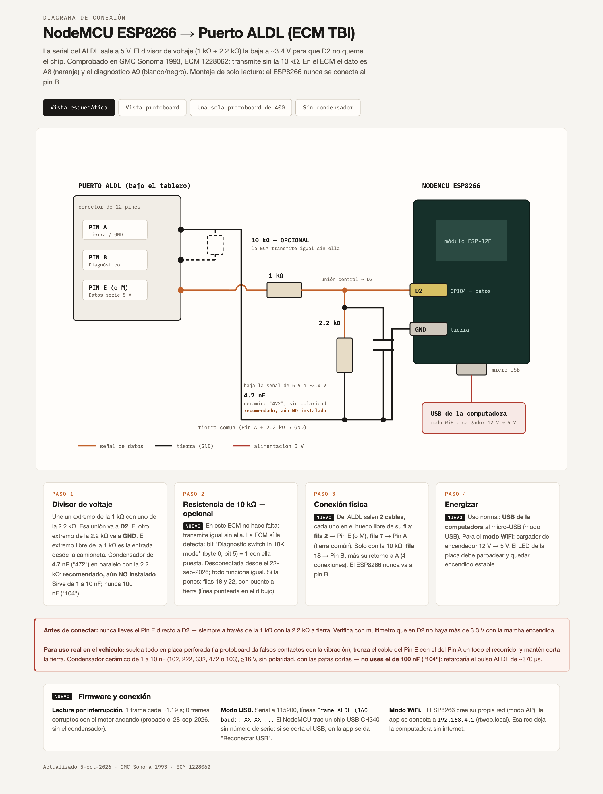
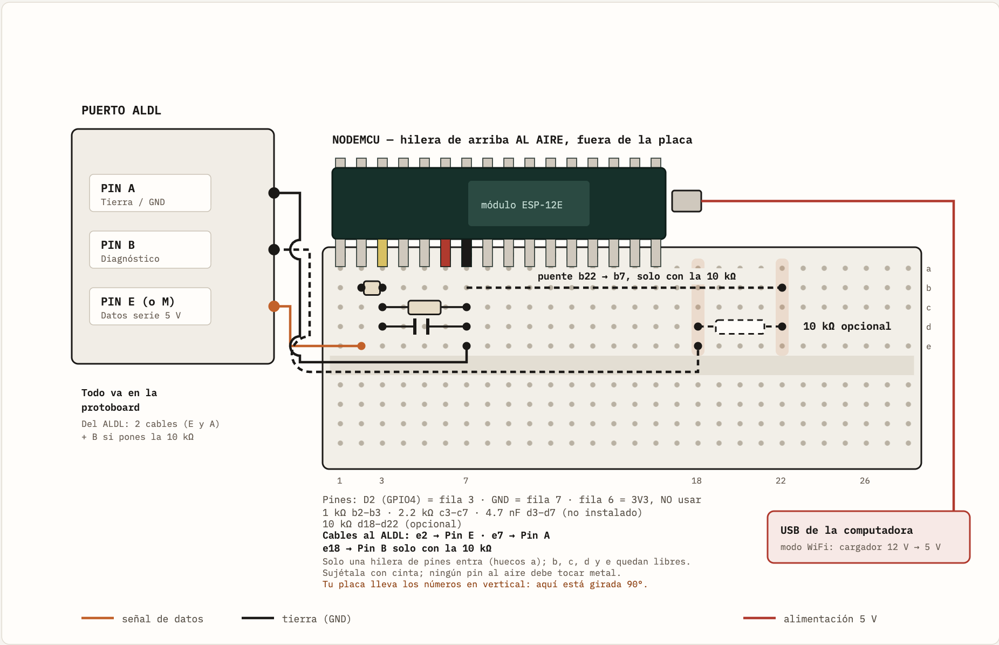
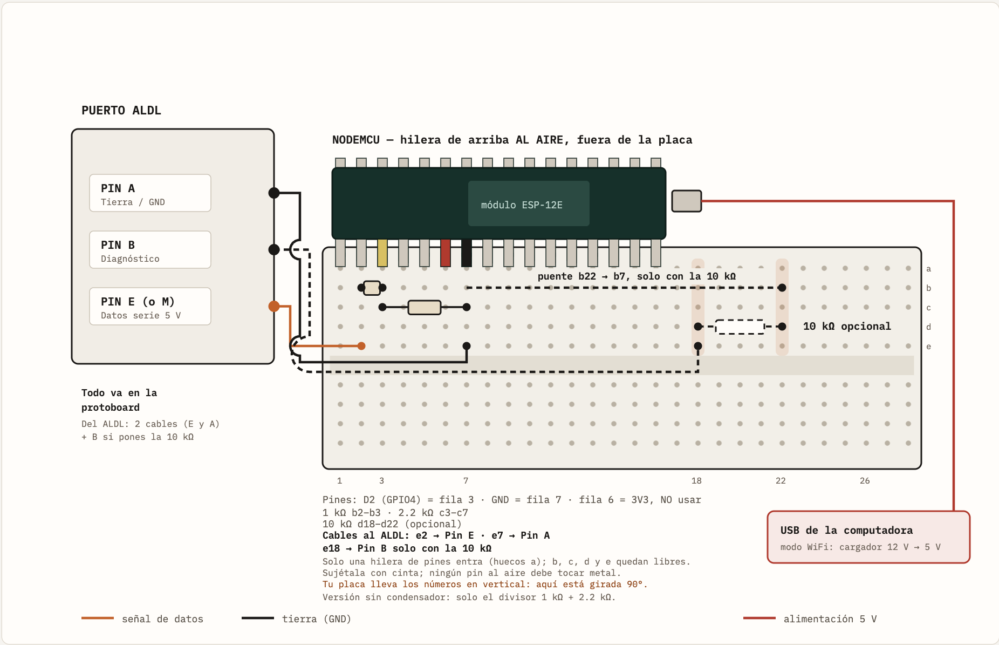
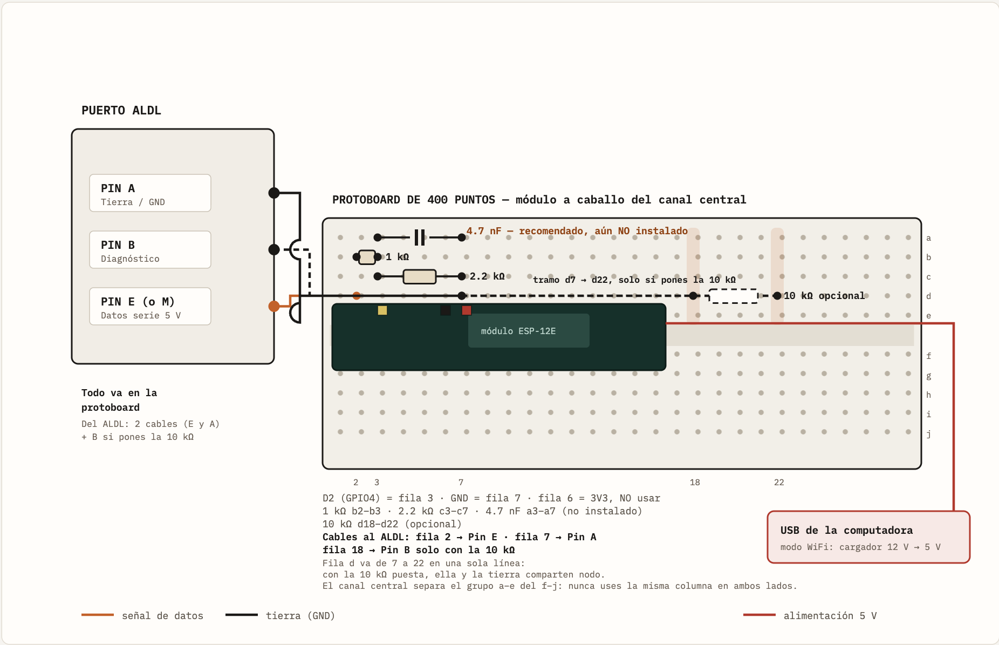

# Conexión electrónica: ESP8266 ↔ conector ALDL

Cómo se conecta el ESP8266 (NodeMCU, módulo ESP-12E) al conector ALDL de un GM OBD1 para
leer su flujo de datos. Es el montaje que usa este proyecto en el **GMC Sonoma 1993**
(ECM 1228062, definición ALDL "A040", 160 baud). Fuente: el "Diagrama ALDL NodeMCU" del
proyecto (versión con condensador anti-ruido, 2026-09-19) y las pruebas reales en ese camión.
Actualizado el 2026-10-05 con lo que se comprobó en el camión: la 10 kΩ no hace falta, el
condensador no está instalado y el firmware lee por interrupción (0 frames corruptos con el motor
andando).

> **Cuidado:** los pines del ESP8266 **no toleran 5 V** (el máximo ronda los 3.6 V). Nunca
> lleves el pin de datos del ALDL directo a D2: siempre por el divisor de abajo, y mide con
> multímetro antes de conectar el ESP8266 por primera vez. Es un montaje casero de solo
> lectura; el proyecto se distribuye sin garantía (GPLv3, ver [LICENSE](../LICENSE)).

## Esquema



Página completa del "Diagrama ALDL NodeMCU" (Claude Design, actualizado el 2026-10-05). El
original editable y su exportación quedan en el espejo privado (`disenos/`).

Lo mismo en texto:

```
  CONECTOR ALDL (12 pines, bajo el tablero)                NodeMCU ESP8266 (ESP-12E)

  Pin E  (datos serie, ~5 V) ──[ 1 kΩ ]──┬───────────┬────────► D2 (GPIO4)
                                         │           │
                                     [ 2.2 kΩ ] [ 4.7 nF ]
                                         │           │
  Pin A  (tierra) ───────────────────────┴───────────┴────────► GND
            │
            └──────[ 10 kΩ ]────────── Pin B  (terminal de diagnóstico)   ← OPCIONAL, ver abajo

  Alimentación del NodeMCU, aparte:  USB de la computadora (modo USB, el uso normal)
                                     o cargador de encendedor 12 V → 5 V ──► micro-USB (modo WiFi)
```

| Desde (conector ALDL) | Hasta | Para qué |
| --- | --- | --- |
| Pin **E** (en algunos conectores, el **M**) | 1 kΩ → nodo → **D2 (GPIO4)** | La señal de datos, ya reducida |
| Pin **A** | GND del NodeMCU, extremo de la 2.2 kΩ y del condensador | Tierra común |
| Pin **B** | 10 kΩ → Pin **A** | **Opcional.** El diagrama dice que hace transmitir a la ECM: en el 1228062 es falso (ver abajo) |
| Nodo de D2 | condensador 4.7 nF → GND | Filtra el ruido del motor. Recomendado; **no está instalado** en el camión |

- **Divisor 1 kΩ + 2.2 kΩ:** la línea de datos sale a ~5 V. En D2 quedan 5 V × 2.2 / (1 + 2.2) ≈ 3.44 V.
- **Condensador de 4.7 nF:** en paralelo con la 2.2 kΩ, o sea entre el nodo de D2 y GND.
- **10 kΩ entre B y A — opcional.** El diagrama original dice que es lo que hace que la ECM
  transmita. **En el 1228062 es falso: el flujo de datos sale igual sin ella.** La ECM sí la
  detecta: con la 10 kΩ puesta, el bit "Diagnostic switch in 10K mode" (byte 0, bit 5) vale 1.
  En los logs vale 1 del 2026-09-16 al 2026-09-21 y 0 desde el 2026-09-22: ahí se soltó o se
  quitó, y desde entonces todo se lee igual sin ella. Ese bit sirve para saber en vivo si está
  puesta. El ESP8266 **no se conecta nunca al pin B**; ahí solo iría la resistencia.
- **Alimentación:** en modo USB (el uso normal) el cable a la computadora alimenta la placa.
  En modo WiFi, micro-USB desde un cargador de encendedor 12 V → 5 V.

En el conector del **ECM** (no el ALDL), el dato sale por el pin **A8** (cable naranja) y el
terminal de diagnóstico es el **A9** (blanco/negro).

## Lista de materiales

- NodeMCU ESP8266 (ESP-12E)
- Resistencias: 1 kΩ y 2.2 kΩ (la 10 kΩ es opcional)
- Condensador cerámico de 4.7 nF (marcado "472"), sin polaridad, de 16 V o más (recomendado)
- Protoboard de 400 puntos (para probar; para el vehículo, ver "Ruido con el motor encendido")
- 2 cables hacia el conector ALDL: E y A (4 si pones la 10 kΩ: B y otro A)
- Cable micro-USB a la computadora (modo USB) o cargador de encendedor 12 V → 5 V (modo WiFi)

## Montaje

1. **Divisor de voltaje.** Une un extremo de la 1 kΩ con uno de la 2.2 kΩ; esa unión va a D2.
   El otro extremo de la 2.2 kΩ va a GND. El extremo libre de la 1 kΩ recibe el dato del ALDL.
   Pon el condensador de 4.7 nF en paralelo con la 2.2 kΩ (mismas columnas, otra fila).
2. **Resistencia de 10 kΩ (opcional).** En dos columnas libres de la protoboard, sin pines del
   NodeMCU; de ahí sale un cable al pin B y otro al pin A. Se puede omitir.
3. **Conexión física.** Pin A → GND del NodeMCU (tierra común). Pin E (o M, según tu
   conector) → extremo libre de la 1 kΩ.
4. **Energizar** por micro-USB. El LED de la placa debe quedar encendido estable.

### En la protoboard

El diagrama trae tres vistas de protoboard. En las tres: **D2 (GPIO4) = fila 3, GND = fila 7, la
fila 6 es 3V3 (no usar)**; 1 kΩ de b2 a b3 y 2.2 kΩ de c3 a c7; la 10 kΩ, si la pones, va de d18
a d22.

**Una sola protoboard de 400** (como está armado: la placa del usuario lleva los números en
vertical, el dibujo está girado 90°). Solo una hilera de pines del NodeMCU entra (huecos a); la
hilera de arriba queda al aire, sujeta con cinta y sin tocar metal. Cables al ALDL: **e2 → pin E,
e7 → pin A** (y e18 → pin B, más el puente b22 → b7, solo con la 10 kΩ). El condensador iría de
d3 a d7.



Versión **sin condensador** (la que está instalada hoy): solo el divisor 1 kΩ + 2.2 kΩ.



Vista de protoboard con el NodeMCU insertado completo (condensador de a3 a a7; cables al ALDL en
la fila 2 → pin E y la fila 7 → pin A):



## Verificación antes de encender el ESP8266

Con multímetro, comprueba que en D2 no haya más de ~3.3 V; el diagrama pide medirlo con el
motor en marcha. Ojo: el cálculo teórico del divisor ya da ~3.44 V a 5.0 V exactos, así que una
diferencia de un par de décimas sobre 3.3 V es esperable; lo preocupante sería medir mucho más.

## Relación con el firmware

- `ALDL_PIN 4` en [esp8266_aldl_bridge.ino](../firmware/esp8266_aldl_bridge/esp8266_aldl_bridge.ino)
  es GPIO4, o sea **D2** en el NodeMCU. Si mueves el cable a otro pin, cambia esa constante.
- **Lectura por interrupción** ([aldl_decoder.h](../firmware/esp8266_aldl_bridge/aldl_decoder.h)):
  anota cada flanco y decodifica aparte. Confirmado en el camión el 2026-09-28 (log `22-06-00`):
  1 frame cada ~1.19 s, 398 de 400 posibles y 0 corruptos con el motor andando. El firmware
  anterior captaba 1 de cada 2 a 4 frames. El 1228062 manda un SYNC de **diez** unos, no nueve.
- **Modo USB de la app** (el normal): el firmware imprime cada frame por Serial a 115200 baud
  como `Frame ALDL (160 baud): XX XX ...`, y cada 10 s una línea `Stats ALDL: ok=... flancos=...`
  (`flancos=0 nivel=bajo` = no llega señal: llave en OFF o cable suelto). El NodeMCU del usuario
  trae un chip USB **CH340 sin número de serie**: si el USB se reinicia, el navegador no lo
  reconoce solo y la app pide "Reconectar USB" (un clic).
- **Modo WiFi:** el ESP8266 transmite su propia red (modo AP, nombre y clave en `secrets.h`);
  la app se conecta a `192.168.4.1` (o `rtweb.local`). Esa red deja a la computadora sin internet.

## Limitaciones conocidas

- **Solo lectura.** El ESP8266 nunca maneja la línea de datos: no hay camino de transmisión
  hacia la ECM. Si una ECM a 8192 baud necesita que le pidan los datos (Mode 1) antes de
  transmitir, este montaje no alcanza y habría que diseñar un driver de salida. Sin verificar,
  porque no hay una ECU real así para probarlo.
- **Ruido con el motor encendido.** El firmware descarta los frames desalineados (PROM ID) y la
  app marca como `sospechoso` los que tienen valores imposibles (sobre 12,475 frames: 0.68 %, casi
  todos del apagado de llave). Con el firmware por interrupción salió 0 corruptos con el motor
  andando, aun sin condensador. Si vuelve a haber ruido, estas son las medidas en hardware:
  - **Condensador cerámico de 4.7 nF (marcado "472") entre D2 y GND**, en paralelo con la
    2.2 kΩ y con las patas lo más cortas posible. Sirve cualquier valor de 1 a 10 nF (102, 222,
    332, 472, 103); no tiene polaridad y basta de 16 V o más. Con la 2.2 kΩ a tierra, la
    constante de tiempo no pasa de 2.2 kΩ × C: con 4.7 nF son ≤ 10 µs, frente a los ~370 µs del
    pulso corto del ALDL. **No uses 100 nF ("104")**: llegaría a ~220 µs y deja poco margen.
    Es un cálculo, no una medición en esta ECM.
  - Tierra corta y sólida: del pin A al GND del NodeMCU por el camino más corto.
  - Cables E y A del conector trenzados en todo el recorrido, lejos de los cables de bujías, la
    bobina y el alternador.
  - Una protoboard en un vehículo da falsos contactos con la vibración que se ven igual que
    ruido; para uso real conviene soldarlo en una placa perforada.

## Pendiente de confirmar

- El voltaje realmente medido en D2 con el motor en marcha.
- **El condensador NO está instalado** (lo confirmó el usuario el 2026-09-28): todos los logs
  hasta esa fecha son sin él. Falta saber si el cable trenzado y la tierra corta están puestos.
  Al instalarlo, comparar el ruido antes y después (por ejemplo, contando las filas del CSV con
  batería > 16 V, INT=0 o BLM=0).
