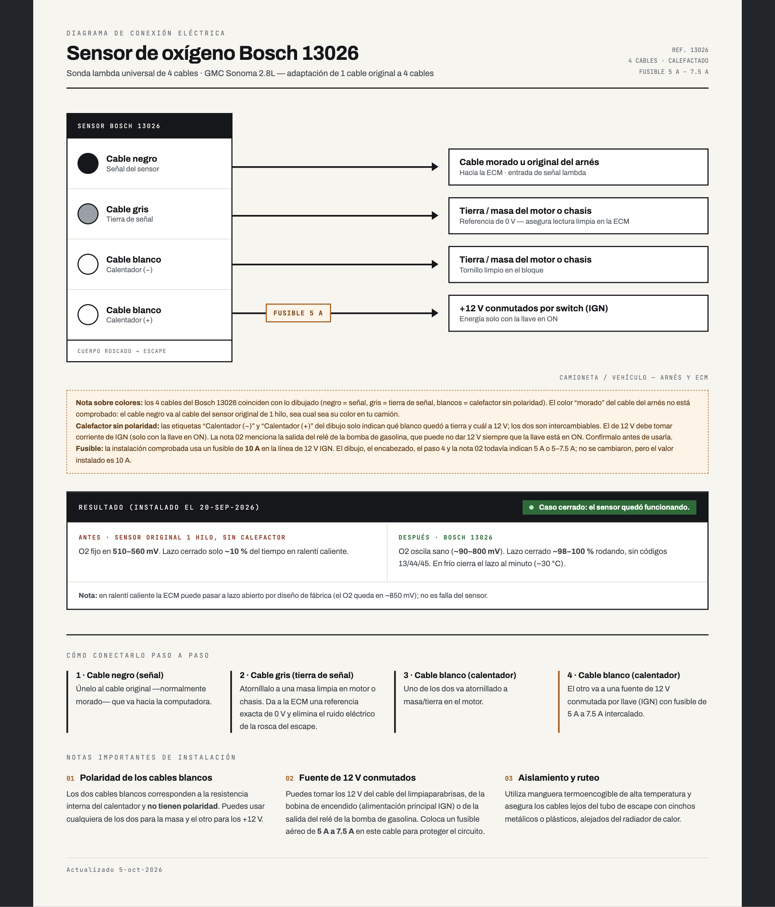

# Sensor O2: Bosch 13026 calefactado en el GMC Sonoma 1993

Cambio del sensor de oxígeno original (1 cable, sin calefactor) por un **Bosch 13026** universal
calefactado de 4 cables, en el GMC Sonoma 1993 2.8L TBI (ECM 1228062). Es el "Primer caso real"
del proyecto: los registros de RT-Web lo encontraron y lo confirmaron. Fuente: el "Diagrama Sensor
Bosch 13026" del proyecto (Claude Design, actualizado el 2026-10-05) y los logs del camión.

El dibujo, el encabezado, el paso 4 y la nota 02 de esa página todavía dicen fusible de 5 A o
5–7.5 A (la recomendación genérica); **lo instalado es de 10 A**, como dice su nota de fusible y la
tabla de abajo. El "cable morado" del arnés tampoco está comprobado: el negro va al cable del
sensor original, sea cual sea su color.

## Cableado

| Cable del Bosch 13026 | Va a | Para qué |
| --- | --- | --- |
| **Negro** | el cable del sensor original de 1 hilo (entrada O2 de la ECM) | señal (0–1 V) |
| **Gris** | tierra | tierra de la señal |
| **Blanco** | **12 V de IGN** (solo con la llave en ON), con **fusible de 10 A** | calefactor |
| **Blanco** | tierra | calefactor (los dos blancos no tienen polaridad) |

- El calefactor jala del orden de 1 A (un poco más en el primer segundo en frío). Con fusible de
  10 A, el cable del calefactor debe ser de calibre 18 AWG o más grueso; con cable más delgado
  (20–22 AWG), mejor un fusible de 5 A.
- Los colores son los de las fichas genéricas de los Bosch universales de 4 cables; confírmalos con
  el instructivo de tu sensor antes de conectar.

## Resultado (instalado el 2026-09-20)

| | Sensor original (1 cable) | Bosch 13026 (4 cables) |
| --- | --- | --- |
| O2 en ralentí caliente | fijo en 510–560 mV | oscila ~90–800 mV |
| Lazo cerrado | ~10 % del tiempo en ralentí caliente | ~100 % en las pruebas de ralentí; 98–100 % rodando |
| Códigos 13 / 44 / 45 | — | ninguno |
| En frío | — | cierra el lazo al minuto (~30 °C) |

**Ojo al leer los logs:** el 2.8L con transmisión manual pasa el ralentí caliente a **lazo abierto
por diseño de fábrica** (ST-336-93, pág. 4-4: "800 RPM, IAC 5–20, OPEN LOOP"). En esos tramos el O2
se queda en ~850 mV porque la mezcla de ralentí va rica a propósito; no es falla del sensor. Antes
de comparar O2 entre logs, mira el bit de lazo (byte 14, bit 7).

Caso cerrado: el sensor quedó funcionando.
